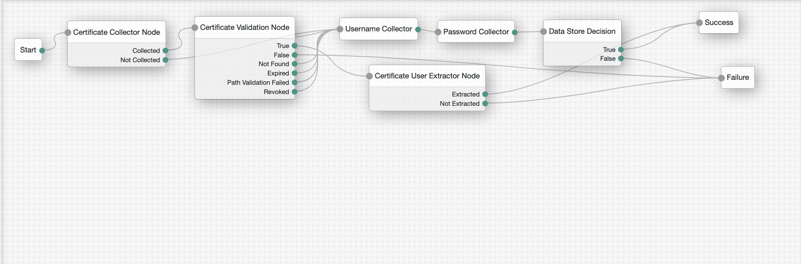

<!--
 * The contents of this file are subject to the terms of the Common Development and
 * Distribution License (the License). You may not use this file except in compliance with the
 * License.
 *
 * You can obtain a copy of the License at legal/CDDLv1.0.txt. See the License for the
 * specific language governing permission and limitations under the License.
 *
 * When distributing Covered Software, include this CDDL Header Notice in each file and include
 * the License file at legal/CDDLv1.0.txt. If applicable, add the following below the CDDL
 * Header, with the fields enclosed by brackets [] replaced by your own identifying
 * information: "Portions copyright [year] [name of copyright owner]".
 *
 * Copyright 2019 ForgeRock AS.
-->
# Certificate Auth Nodes

The Certificate authentication node lets administrators integrate X.509 digital certificates into an AM authentication
trees.

X.509 digital certificates can enable secure authentication without the need for user names and passwords or other
credentials. Certificate authentication can be used to manage authentication by applications. If all certificates are
signed by a recognized Certificate Authority (CA), then you might not need additional configuration. If you need to
look up public keys of AM clients, these nodes can also look up public keys in an LDAP directory server.

**Note:** 
* These nodes will only work with Access Management 6.5.2 and above.

## Usage

###Installation
To deploy these nodes, download the jar from the releases tab on github 
[here](https://github.com/FrankGasparovic/Certificate-Auth-Tree-Node/releases/latest). Next, copy the jar into the 
../web-container/webapps/openam/WEB-INF/lib directory where AM is deployed. Restart the web container to pick up the 
new node. The node will then appear in the authentication trees components palette.

###Node Descriptions

Certificate Collector Node  - This node is used to collect an X509 Certificate from a user who is authenticating to AM.

Certificate Validation Node - This node is used to validate the collected certificate.

Certificate User Extractor - This node is used to extract a value from the certificate, and return it to AM to lookup the user.

### Certificate Collector Node Configuration
* **Certificate Collection Method** - This field defines how the certificate should be client certificate should be
collected from the request. If TLS termination happens at the web container that is running Access Management, 
choose Request. If you have Access Management behind a proxy or load balancer and terminate TLS there, select Header
. If Either is selected, the collector node will first look at the request, then look at the HTTP Header Name for Client
Certificate specified in that order.
* **HTTP Header Name for Client Certificate** - The name of the HTTP request header containing the certificate, only
used when Header based collection is enabled.
* **Trusted Remote Hosts** - A list of IP addresses trusted to supply client certificates. If SSL/TLS is being
terminated at a load balancer or at the Distributed Authentication server then this option can be used to ensure
that only specified trusted hosts (identified by IP address) are allowed to supply client certificates to the
certificate node. Other valid values for this list are none and any. Any empty allows requests for any host.

### Certificate Validation Node Configuration
* **Match Certificate in LDAP** - The client certificate must exist in the directory for the authentication to be 
successful.
* **Check Certificate Expiration** - Check to see if the certificate is expired.
* **Subject DN Attribute Used to Search LDAP for Certificates** - This is the attribute used to search the directory
for the certificate. The Certificate node will search the directory for the certificate using the search filter
based on this attribute and the value of the Subject DN taken from the certificate.
* **Match Certificate to CRL** - The Client Certificate will be checked against the Certificate Revocation list held
in the directory. A Certificate Revocation List can be provisioned into the directory. Having this option enabled 
will cause all client certificates to be checked against this list.
* **Issuer DN Attribute(s) Used to Search LDAP for CRLs** - This is the name of the attribute taken from the CA
 certificate that will be used to search the CRL. If only one attribute name is specified, the ldap search filter
will be <code>(attrName=Value_of_the_corresponding_Attribute_from_SubjectDN)</code> e.g. SubjectDN of issuer cert
'C=US, CN=Some CA, serialNumber=123456', attribute name specified is 'CN', search filter used will be <code>(CN
=Some CA)</code>. If several attribute names are specified, they have to separated by <code>,</code>. The resulting ldap search filter
value will be a comma separated list of name attribute values, the search attribute will be cn e.g. SubjectDN of
issuer cert 'C=US, CN=Some CA, serialNumber=123456', attribute names specified are 'CN, serialNumber', search filter
used will be <code>cn=CN=Some CA,serialNumber=123456</code>. The order of the values of the attribute names matter
as they must match the value of the cn attribute of a crlDistributionPoint entry in the directory server.
* **HTTP Parameters for CRL Update** - These parameters will be included in any HTTP CRL call to the Certificate
 Authority. If the Client or CA certificate contains the Issuing Distribution Point Extension then OpenAM will use this
information to retrieve the CRL from the distribution point. This property allow custom HTTP parameters to be
included in the CRL request. The format of the parameter is as follows: <code>param1=value1,
param2=value</code>
* **Cache CRLs in Memory** - The CRLs will be cached in memory.
* **Update CA CRLs from CRLDistributionPoint** - Fetch new CA CRLs from CRLDistributionPoint and update it 
in Directory Server. If the CA certificate includes an IssuingDistributionPoint or has an CRLDistributionPoint extension 
set AM tries to update the CRLs if needed (i.e. CRL is out-of-date). This property controls if the update should
be performed. This property is only used if CA CRL checking is enabled.
* **OCSP Validation** - Enable Online Certificate Status Protocol validation for OCSP aware certificates. 
If the certificate contains OCSP validation information then AM will use this information to check the
validity of the certificate as part of the authentication process. The AM server must have Internet
connectivity for OCSP to work.
* **LDAP Server Where Certificates are Stored** - Use this list to set the LDAP server used to search for
certificates. The Certificate authentication node will use this list for the LDAP server used to search for
certificates. A single entry must be in the format:<code>ldap_server:port</code>. Multiple entries allow
associations between AM servers and a LDAP server. The format is:<code>local server name | server:port</code>The local
server name is the full name of the server from the list of servers and sites.
* **LDAP Search Start or Base DN** - The start point in the LDAP server for the certificate and CRL search. When
entering multiple entries, each entry must be prefixed with a local server name. Multiple entries allow different
search Base DNs depending on the AM server in use. The format is:<code>local server name | basedn</code>. The local
server name is the full name of the server from the list of servers and sites.
* **LDAP Server Authentication User** - DN of the user used by the node to authenticate to the LDAP server. The
Certificate node authenticates to the LDAP server in order to search for a matching certificate. The DN entered here
represents the account used for said authentication and must have read/search access to the LDAP server.
* **LDAP Server Authentication Password** - The password for the authentication user. Note - A value must be set or
 the node will fail.
* **Use SSL/TLS for LDAP Access** - The certificate node will use SSL/TLS to access the LDAP server.
 
 ### Certificate User Extractor Node Configuration
* **Certificate Field Used to Access User Profile** - The certificate node needs to read a value from the client certificate
that can be used to search the LDAP server for the user. This value from the certificate will be populated in
shared state under the username key.
* **Other Certificate Field Used to Access User Profile** - This field is only used if the <code>Certificate Field
 Used to Access User Profile</code> attribute is set to <code>other</code>. This field allows a custom certificate field to be used as the
basis of the user search.
* **SubjectAltNameExt Value Type to Access User Profile** - Use the Subject Alternative Name Field in preference to one of the
standard certificate fields. Selecting RFC822Name or UPN will cause this field to have have precedence over
the <code>Certificate Field Used to Access User Profile</code> or <code>Other Certificate Field Used to Access User
Profile</code> attribute.

 ### Example Flow
 
 #### Authenticate an end user with a certificate
 
 To use the Certificate Nodes to Authenticate an end user. Falls back to Username/Password authentication if a
  failure occurs.
 
 
 

